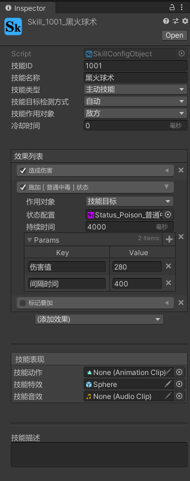

# EGamePlay
## 请用 Unity 2019.4.1 以上版本打开
---
## 知乎文章：

- [如何实现一个灵活、通用的战斗（技能）系统——序章](https://zhuanlan.zhihu.com/p/272216809)
- [如何实现一个灵活、通用的战斗（技能）系统——数值系统](https://zhuanlan.zhihu.com/p/269901872)
- [如何实现一个灵活、通用的战斗（技能）系统——数值系统（升级版）](https://zhuanlan.zhihu.com/p/274795206)
- [如何实现一个灵活、通用的战斗（技能）系统——战斗行动机制](https://zhuanlan.zhihu.com/p/272865602)
- [如何实现一个灵活、通用的战斗（技能）系统——能力Ability](https://zhuanlan.zhihu.com/p/292590253)
- [如何实现一个灵活、通用的战斗（技能）系统——Status状态效果](https://zhuanlan.zhihu.com/p/334825494)
---

***
## 基于Odin和ScriptableObject实现的灵活的技能、buff配置工具
<!-- 

 -->

