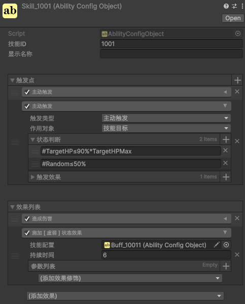
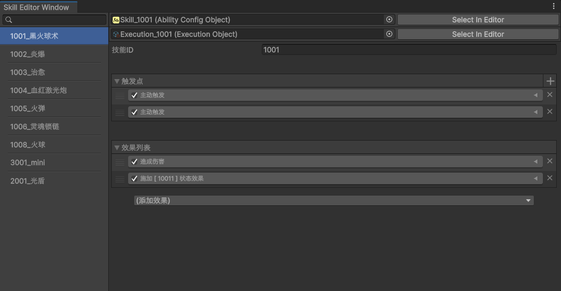
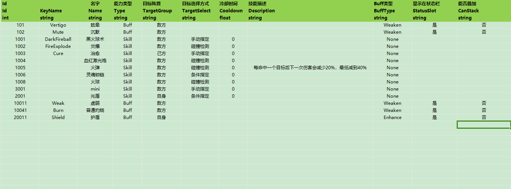

# ***EGamePlay***


---
# 这个是2.0的版本，之前的版本在1.0分支

2.0版本的改动主要有以下几个地方

1、将SkillAbility和StatusAbility统一为Ability，实体类和配置表都统一，通过配置表里的Type字段区分Skill和Buff

2、不再分Excel流程和ScriptableObject流程，2.0的效果结构更复杂，Excel不好表达，统一为Excel做技能信息配置，SO做效果配置AbilityConfigObject

3、AbilityConfigObject的效果配置拆分为```触发点```和```效果列表```分开配置，通过触发点去触发效果，触发点分为主动触发和被动触发，主动触发通过技能执行体触发，其余的都是被动触发，比如大多数的buff触发机制

4、执行体里的碰撞体配置改为更方便扩展的效果列表配置

---
[](https://unity3d.com/get-unity/download/archive) [](https://github.com/m969/EGamePlay/projects/1)

## Stargazers over time

[](https://starchart.cc/m969/EGamePlay)

---
# 文档：
- [EGamePlay文档(wiki)](https://github.com/m969/EGamePlay/wiki)

# 商业项目
- [暗黑之地](https://www.taptap.cn/app/227372) https://www.taptap.cn/app/227372 一个人开发，用EGP重写了整个战斗后重新上线

---
## 知乎文章：

- [0、如何实现一个灵活、通用的战斗（技能）系统——序章](https://zhuanlan.zhihu.com/p/272216809)
- [1、如何实现一个灵活、通用的战斗（技能）系统——数值系统](https://zhuanlan.zhihu.com/p/269901872)
- [2、如何实现一个灵活、通用的战斗（技能）系统——数值系统（升级版）](https://zhuanlan.zhihu.com/p/274795206)
- [3、如何实现一个灵活、通用的战斗（技能）系统——战斗行动机制](https://zhuanlan.zhihu.com/p/272865602)
- [4、如何实现一个灵活、通用的战斗（技能）系统——战斗实体](https://zhuanlan.zhihu.com/p/284192989)
- [5、如何实现一个灵活、通用的战斗（技能）系统——能力Ability](https://zhuanlan.zhihu.com/p/292590253)
- [6、如何实现一个灵活、通用的战斗（技能）系统——Status状态效果](https://zhuanlan.zhihu.com/p/334825494)
- [7、如何实现一个灵活、通用的战斗（技能）系统——Skill技能](https://zhuanlan.zhihu.com/p/340447052)
- [8、如何实现一个灵活、通用的战斗（技能）系统——技能效果](https://zhuanlan.zhihu.com/p/341431038)
- [9、如何实现一个灵活、通用的战斗（技能）系统——Entity-Component模式](https://zhuanlan.zhihu.com/p/343624199)
---

## demo运行
- rpg demo，运行RpgExample Scene场景
- 回合制demo，运行TurnBaseExample Scene场景
- 技能调试编辑，运行ExecutionLinkScene场景

---
## 如何制作一个简单的技能
- 首先在AbilityConfig.xlsx表里添加一个技能，给定技能id，配置参数
- 然后右键选择 ```能力/能力配置``` 创建对应id的技能配置，配置效果
- 然后右键选择 ```能力/Execution``` 创建对应id的技能执行体，配置片段表现
- 最后就是运行时将技能挂载到CombatEntity上，再通过施法组件SpellComponent释放技能即可

---

## 该项目使用了以下收费插件：
- [DOTween Pro](https://assetstore.unity.com/packages/tools/visual-scripting/dotween-pro-32416) （简单易用强大的动画插件）
- [Odin Inspector](https://assetstore.unity.com/packages/tools/utilities/odin-inspector-and-serializer-89041) （编辑器扩展、工作流改善）
- [Animancer Pro](https://assetstore.unity.com/packages/tools/animation/animancer-pro-116514) （基于Playable的简单强大的Animation解决方案）
---

## 如何将EGamePlay移植到别的Unity工程
如果要将EGamePlay移植到自己的Unity工程里，首先要确保Odin Inspector插件已经在工程中，并加上UNITY条件编译，最后将以下目录复制过去即可：
- EGamePlay/Assets/Editor
- EGamePlay/Assets/EGamePlay
- EGamePlay/Assets/EGamePlay.Unity
- EGamePlay/Assets/Plugins/Editor/npoi
- EGamePlay/Excel

---
## 如何将EGamePlay移植到ET框架里
- 把EGamePlay/Assets/Editor移到ET.Editor程序集下
- 把EGamePlay/Assets/EGamePlay移到Model程序集下 
- 把EGamePlay/Assets/EGamePlay.Unity移到ModelView程序集下 
- 最后要添加条件编译EGAMEPLAY_ET

可以参考这个联网同步demo https://github.com/m969/AOGame

## EGamePlay demo示意图
---


***

---
## 基于Odin和ScriptableObject实现的灵活的技能、buff配置工具




### 技能Excel配置


---
## EGamePlay战斗框架技术讨论交流qq群：763696367
对战斗感兴趣的同学可以进群一起探讨更合适、高效的战斗框架实现
<br>对EGamePlay有任何疑问或建议可以进群反馈，或是提在[Discussions](https://github.com/m969/EGamePlay/discussions)

---
## 其他类似项目
- https://github.com/KrazyL/SkillSystem-3 (Dota2 alike Skill System Implementation for KnightPhone)
- https://github.com/weichx/AbilitySystem
- https://github.com/dongweiPeng/SkillSystem (丰富的接口可便于使用扩展 完整的技能效果流程【如流程图】 配套的技能管理器 自定义的技能数据表)
- https://github.com/sjai013/UnityGameplayAbilitySystem (The approach for this is taken from that used by Unreal's Gameplay Ability System, but implemented in Unity using the Data-Oriented Technology Stack (DOTS) where possible.)
- https://github.com/dx50075/SkillSystem (skill system for unity ， 思路 http://blog.csdn.net/qq18052887/article/details/50358463
技能描述文件如下 skill(1000) //技能1 { FaceToTarget(0) PlayAnimation(1,Skill_1) Bullet(1.3,Bullet,7) PlayEffect(0,Explode8,3) })

---
## 参考
- https://github.com/egametang/ET
